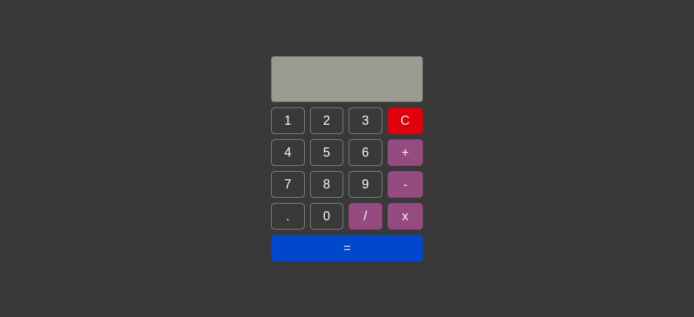

<h1> Calculadora</h1>
<h2> Projeto web de uma calculadora simples.</h2>
<h1 align="center">
  
</h1>
<h4>Como testar o projeto?</h4>

Basta acessar o link: <a href="https://silmplecalculadora.netlify.app/">https://silmplecalculadora.netlify.app/</a>

### Autor
---

<a href="https://www.linkedin.com/in/oliveira-joao-victor/">
 
  
 <b>João Victor Oliveira</b></a> <a href="https://www.linkedin.com/in/oliveira-joao-victor/">🚀</a>

Feito com ❤️ por João Victor!
Linkedin: https://www.linkedin.com/in/oliveira-joao-victor/
